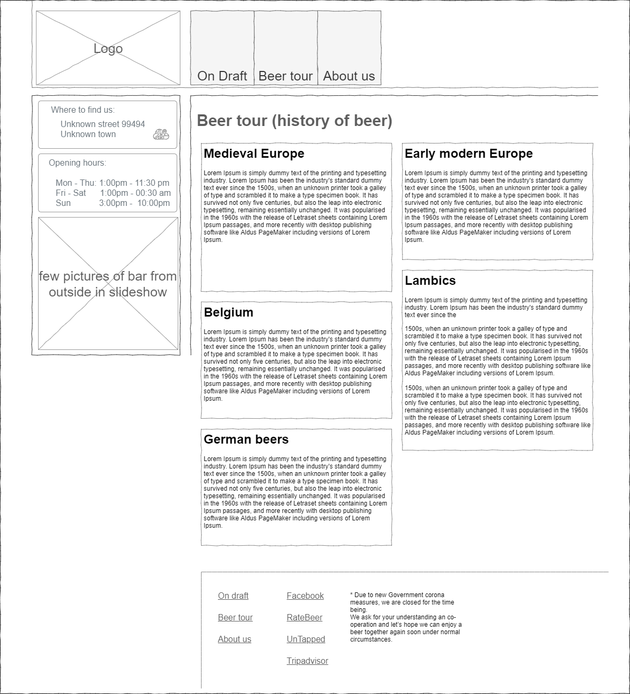

# Project: Jiri's Bar (CodeInstitute - fullstack development course - project 1)

Presentation of an imaginary bar, providing information on where to find it, what are opening hours. List of available beverages, little of history of those offered and possiblity to contact owner and make a booking.   

Website: [GitHub pages](https://citanus006.github.io/codeinstitute-project1-Jiris-bar)  
Repository: [GitHub](https://github.com/citanus006/codeinstitute-project1-Jiris-bar)

## Project  goals

Page should be useful for new and returning guests of the bar. Helping those who are new to find the place and check and see what to expect, while providing nice overview what is currently on tap for those who are already familiar with the place.    

## Designs and mockups

Mockups and wireframes were designed using draw.io available as part of nextcloud instance running on my own server at (https://nextcloud.jvitek.org). Design is intended as separate pages for each section of web presentation. 

On every page should be contact information, together with address and navigation in header and footer with links to social media.  

### Desktop version

- Home page contains brief information about the bar, description of offered selection and links to subsequent pages. 

- On Draft page is displaying current offer together with brief information about a beverage, and it's price.

- Beer tour page captures important historical facts about particular beers and ber types.

- About us page - brief history of bar, information about the owner and contact form for booking purposes. 

### Tablet version

Menu should be displayed in full, while the sidebar with opening hours, location and pictures of the place will be displayed below main content  

### Mobile phone version

Everything should be displayed in one column with a menu minimized by default. Footer will adapt as well. 

## Final design - screenshots

## Computer screen version

## Tablet version

## Mobile phone version

## Features
- Version control system - I used git without any branching strategy in order to keep it simple
- HTML & CSS layout
- Documentation - this readme & git history
- Documentation - licence
- Drop down menu for mobile devices
- UX and responsiveness
- Github remote repository
- Social networks links (blank links to home pages of each network)
- Icons (used for map icon)
- Contact form - Form Spark

## Features to be added
As scope of this project is focused on HTML and CSS so I attempted to avoid using javascript and another advanced techniques used in today's webdesign.

## Technologies used:
 - [HTML](https://developer.mozilla.org/en-US/docs/Web/Guide/HTML/HTML5) - Structure and semantic content
 - [CSS](https://developer.mozilla.org/en-US/docs/Web/CSS) - to add design and style to displayed content
 - [JavaScript](https://developer.mozilla.org/en-US/docs/Web/JavaScript) (required for Bootstrap framework to work)
 - [PhpStorm](https://www.jetbrains.com/phpstorm/) - IDE used to create this project
 - [Bootstrap 5](https://getbootstrap.com/)  - UX and responsive design  
 - [HTML](https://validator.w3.org/) & [CSS](https://jigsaw.w3.org/css-validator/) Validation
 - [Github](https://www.github.com/) - distributed version control hosting used from this project
 - [Github Pages](https://pages.github.com/) - Used as hosting for this project 
 - [Google Fonts](https://fonts.google.com/) - Used to guarantee that same font will be used on all platforms. Also used as source of certain icons used in page.
 - [Formspark](https://formspark.io/) - Used as hosting for contact form
 
## Testing

### Primary testing using Google Chrome's developer tools.

Using technology available in Google Chrome browser, checking responsiveness, navigation and links. One platform at the time and ability to resize screen as well. 
 - Mobile & Tablet - I used testing in browser developer tools via device toolbar
 - Desktop (tested on standard screen a laptop)

Test all above devices and check all buttons and links are visible can be clicked and lead to correct sections of web presentation or external sites. Verify that contact form can be used on all platforms.

### Secondary testing - Validation via available online tools
 - HTML - passed - [Validator W3.org](https://validator.w3.org/nu/?doc=https%3A%2F%2Fcitanus006.github.io%2Fcodeinstitute-project1-Jiris-bar%2F)
 - CSS - developed code passed test. However, external resources (Bootstrap 5 did not) - [Jigsaw W3.org](https://jigsaw.w3.org/css-validator/validator?uri=https%3A%2F%2Fcitanus006.github.io%2Fcodeinstitute-project1-Jiris-bar%2F%23AboutUs&profile=css3svg&usermedium=all&warning=1&vextwarning=&lang=en) 
 - Page load speed testing - score 90/100 [Google's PageSpeed Onsights](https://developers.google.com/speed/pagespeed/insights/?url=https%3A%2F%2Fcitanus006.github.io%2Fcodeinstitute-project1-Jiris-bar%2F%23AboutUs)

## Development process
 1. Created wire frames in order to get picture how my responsive layout should look like and how particular sections will be resizing and folding. 
 2. Secondly I designed the responsive layout using Bootstrap 5 grid system on paper.
 3. Implemented responsive layout using own html and css together with bootstrap 5 grid system and columns.
 4. Tested my layout for all expected device types - mobile, tablet and screen - all worked after some tunning.   
 5. Styled my layout using color scheme I chose.
 6. Created side bar and styled it.
 7. Optimized navigation bar and made it working on mobile devices.
 8. Styled first content page - headers and paragraphs.
 9. Created and styled on tap beer page and tested its responsiveness on all device types.
 10. Created and styled on beer tour page menu and tested its responsiveness on all device types.
 11. Picked Formspark over Google forms as contact form provider as it allows custom forms and utilize hosted service only as backend.
 12. Implemented contact form and styled it
 13. Checked responsiveness and design of whole page on all expected devices and committed adjustments.
 14. Checked page in validators and committed adjustments.
 15. Updated this readme with the latest modifications and screenshots of final product.
 16. Tested and adjusted contact form.

 

## Deployment
The host for this site is [Github Pages](https://pages.github.com/) which renders github repository as publicly accessible website. Documentation used to make it work can be found [here](https://docs.github.com/en/github/working-with-github-pages/configuring-a-publishing-source-for-your-github-pages-site). 

## Technological limitation, obstacles and design decisions
 - I decided to avoid manual image compression so far as it is something what is usually done during build or deployment phase and is outside of scope of this project.
 - I decided to use one long page layout instead of individual pages per menu item 
 - I decided not to add pictures of every single beer as those would be too time-consuming without sever adjustment in graphical programs
 - I decided not to create my own logo for the bar as I ran out of time - original idea was infographic of beer glass and tap
 - Site is missing style sheet for printing
 - Site is missing optimisation for screen readers and accessibility
 - contact form redirect after submission is leading to empty page

## Credits and references
 - Wikipedia for articles about beer:
    - https://en.wikipedia.org/wiki/History_of_beer
    - https://en.wikipedia.org/wiki/Beer_in_Belgium
    - https://en.wikipedia.org/wiki/Beer_in_Germany
 - credit to my mentor [Oluwafemi Medale
   ](https://www.linkedin.com/in/omedale/?originalSubdomain=ng) and [codeinsitute](https://codeinsitute.net/)